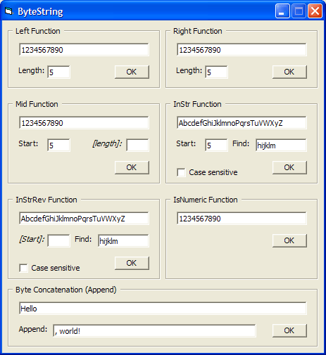

<div align="center">

## ByteString \- String Functions For Byte Arrays


</div>

### Description

Perform common string functions on byte arrays. Concatenation, InStr, InStrRev, Left, Mid, Right, and IsNumeric. Most functions have the option of returning either a string, or a byte array (there is a function for each). Takes advantage of the CopyMemory API function for speed. Now you can work with byte arrays almost as easily as you can with strings without a speed sacrifice. I put all the code in a module (as opposed to a class) because these are just functions, and I don't see any benefit of having it in a class module. If you have any comments/suggestions/bug reports, post them here so I can update the code. Also leave a comment if you find this useful. :)
 
### More Info
 


<span>             |<span>
---                |---
**Submitted On**   |2006-11-22 05:44:48
**By**             |[Nite Software Solutions](https://github.com/Planet-Source-Code/PSCIndex/blob/master/ByAuthor/nite-software-solutions.md)
**Level**          |Beginner
**User Rating**    |4.8 (24 globes from 5 users)
**Compatibility**  |VB 5\.0, VB 6\.0
**Category**       |[VB function enhancement](https://github.com/Planet-Source-Code/PSCIndex/blob/master/ByCategory/vb-function-enhancement__1-25.md)
**World**          |[Visual Basic](https://github.com/Planet-Source-Code/PSCIndex/blob/master/ByWorld/visual-basic.md)
**Archive File**   |[ByteString20324311222006\.zip](https://github.com/Planet-Source-Code/nite-software-solutions-bytestring-string-functions-for-byte-arrays__1-67157/archive/master.zip)

### API Declarations

```
Declare Sub CopyMemory Lib "kernel32" Alias "RtlMoveMemory" (Destination As Any, Source As Any, ByVal Length As Long)
```


